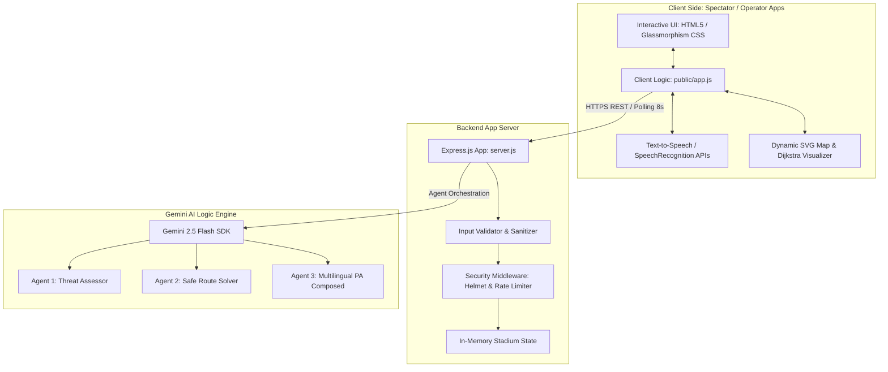
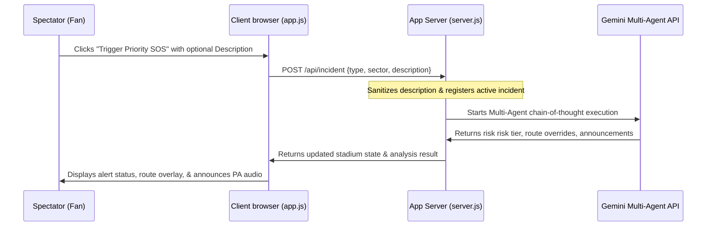

# SafeFlow Stadium Safety Command Center: System Architecture

SafeFlow is a stateless, containerized safety monitoring and emergency routing application designed for cricket stadiums. It integrates real-time telemetry, interactive maps, Dijkstra-based pathfinding, bilingual voice assistance, and a multi-agent Gemini orchestration pipeline.

---

## 1. High-Level Architecture

The system follows a modern client-server architecture with modular concerns:



---

## 2. Component Design

### 2.1. Frontend App Client (`public/`)
* **`index.html`**: Marketing landing page. **`app.html`**: Main SPA serving both Fan and Staff/Admin interfaces with role-gated visibility. ARIA attributes (`role`, `aria-label`, `aria-live`) throughout.
* **`css/app.css`**: Full design system using OKLCH custom properties. Token architecture for spacing, radius, elevation, and motion. Dark and light themes via `:root` / `body.theme-light` variable overrides.
* **`app.js`**: Core client orchestration managing:
  - **State Polling**: Periodically fetches live stadium state (`/api/stadium-state`) every 8 seconds.
  - **Dijkstra Visualizer**: Draws safe paths dynamically onto twin inline SVG stadium maps.
  - **Bilingual Interface (EN/HI)**: Re-maps labels and placeholders dynamically using language maps.
  - **Web Speech & Synthesis**: Converts speech transcriptions (`SpeechRecognition`) into intent actions, auto-detects language scripts (Devanagari, Tamil, Telugu), and reads out public announcements (`SpeechSynthesis`).

### 2.2. Backend Web Server (`server.js`)
* **Server Framework**: Node.js Express server running in ES Module mode.
* **Security & Scalability Middleware**:
  - `helmet`: Strengthens HTTP response headers (XSS filters, referrer policy, content-type sniffing protection).
  - `express-rate-limit`: Rate limits endpoints to prevent abuse (100 requests per minute per IP).
  - **Input Sanitization**: Replaces standard HTML character entities (`<` $\rightarrow$ `&lt;`, `>` $\rightarrow$ `&gt;`) to prevent XSS payloads.
* **In-Memory Store**: Manages stateless mock sector telemetry (crowd densities, lighting, guard counts, active incidents).

### 2.3. Gemini Multi-Agent Pipeline
The backend features a three-agent Gemini 2.5 Flash pipeline executing sequential chain-of-thought analysis:

1. **Agent 1: Threat Assessor (Triage)**
   - Analyzes incoming incidents, assigns a standardized threat tier (`Low`, `Medium`, `High`, `Critical`), calculates resource dispatches, and recommends localized crowd diversions.
2. **Agent 2: Safe Route Solver (Dijkstra Pathfinding)**
   - Resolves safe passage coordinates from the incident stand to VIP Section A, recalculating weights dynamically to avoid active hazard stands and low-light sectors.
3. **Agent 3: Public Communication Coordinator (Multilingual Output)**
   - Receives instructions from Agents 1 & 2. Formulates public address announcements in the attendee's detected language (English or Hindi Devanagari) while retaining English briefings for operators.

---

## 3. Data & Communication Flows

### 3.1. Incident Trigger and Dispatch Flow
When an SOS is dispatched (via Spectator UI, Operator UI, or Voice Intent):



### 3.2. Real-Time State Sync Loop
To maintain consistency across operator and spectator views, a polling mechanism queries the server:

```mermaid
loop Every 8 Seconds
    Client(app.js)->>Server(server.js): GET /api/stadium-state
    Server(server.js)-->>Client(app.js): JSON state telemetry
    Client(app.js)->>Client(app.js): Redraws SVG map & updates incident counters
end
```

---

## 4. Dijkstra Pathfinding Logic

Pathfinding maps the stadium stands as a weighted graph ($V, E$):
* **Nodes**: Sectors $A, B, C, D, E, F$.
* **Base Edges**: Standard pathways between adjacent stands.
* **Dynamic Weight Adjustment**:
  - **Lighting penalty**: Sectors with Low lighting receive a penalty modifier.
  - **Congestion/Density penalty**: Dense sectors increase edge weights exponentially.
  - **Active incident penalty**: Any sector with an active hazard block is given a near-infinite weight (effectively cutting off routes through that area).

---

## 5. Security & Deployment

* **Stateless Deployment**: Built as a self-contained container using a `Dockerfile`, deployed to **Google Cloud Run** in `us-central1` with auto-scaling to zero to optimize resources.
* **Access Headers**: Configured with CORS constraints, Helmet security headers, and rate limiting to enforce API integrity.
